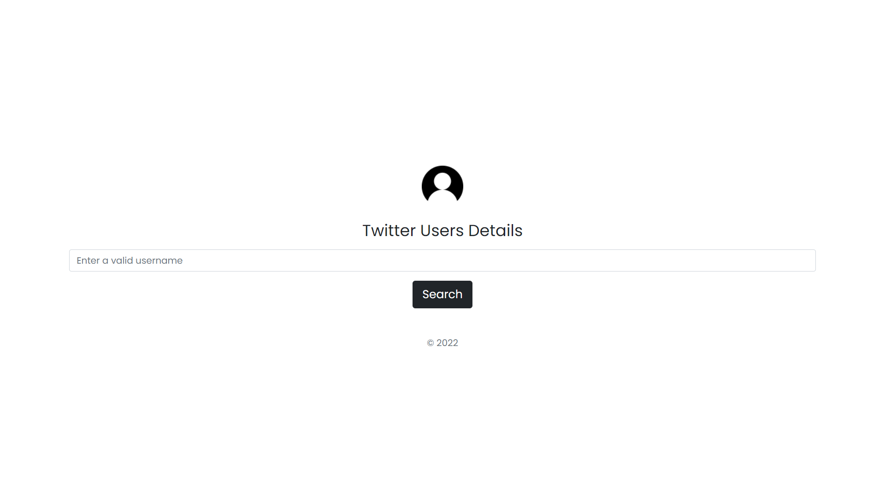
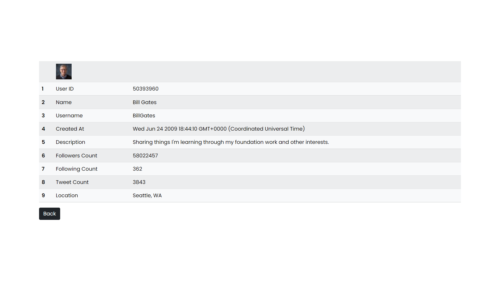

# Twitmapper

Twitmapper is a simple Webapp to fetch the details of twitter users with their username using Twitter API

___

Libraries Used :

- [Twitter.js](https://github.com/twitterjs/twitter.js)

  

#### Explore the site »

  

- [Go to Site](https://twitmapper.herokuapp.com/)

- [Repo Link](https://github.com/adhilameenet/twitter-api)

  





  

### Team Members

- [adhilameenet](https://github.com/adhilameenet)

- [hadibinnoor](https://github.com/hadui)

- [ismailnajeeb](https://github.com/issunajeeb7)

  

## Setup

  

The first thing to do is to clone the repository:

  

```sh

$ git clone https://github.com/adhilameenet/twitter-api

$ cd twitter-api

```

  

create a .env file in project folder and set your own BEARER_TOKEN generated from Twitter Developer Account

  

Then install the dependencies:

  

```sh

npm install

```

  

Then run the server using

  

```sh

$ npm start

```

  

And navigate to `http://127.0.0.1:3000/`.